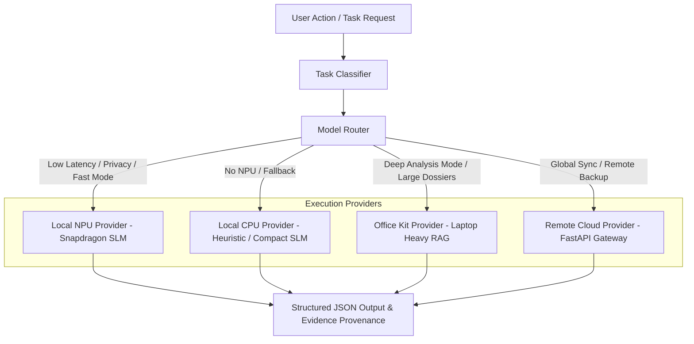

# JobBlitz — AI Architecture Specification

## 1. System Overview

JobBlitz uses a provider-independent AI layer with a multi-tier Model Router. The mobile application does not directly depend on any single remote API (such as Gemini or OpenAI).



## 2. Model Router Abstraction (`AIModelProvider`)

```typescript
export type ProviderType = 'LOCAL_NPU' | 'LOCAL_CPU' | 'OFFICE_KIT' | 'REMOTE_CLOUD';

export interface ModelTaskRequest {
  taskType:
    | 'job_classification'
    | 'skill_extraction'
    | 'job_match'
    | 'readiness_assessment'
    | 'resume_defense'
    | 'star_interview_evaluation'
    | 'deep_dossier_analysis';
  inputData: Record<string, any>;
  preferLocal?: boolean;
  allowOfficeKit?: boolean;
}

export interface ModelTaskResponse<T = any> {
  result: T;
  provider: ProviderType;
  device: string; // e.g. "Snapdragon NPU", "CPU", "Laptop Workstation", "Cloud Server"
  latencyMs: number;
  confidenceScore: number;
  evidence: Array<{
    claim: string;
    sourceType: 'OFFICIAL' | 'PUBLIC_SIGNAL' | 'USER_CONTRIBUTION' | 'AI_INFERENCE';
    url?: string;
  }>;
}
```

## 3. Local SLM & Snapdragon NPU Benchmarking Strategy

Candidate open-source small language models (SLMs) for on-device inference:

1. **Qwen2.5-Coder-1.5B-Instruct (INT4 Quantized)**: Primary target for code analysis, skill extraction, and JSON schema enforcement.
2. **Gemma-2B-IT (INT4 Quantized)**: Alternative for conversational mock interview feedback and STAR story coaching.
3. **Execution Runtime**: ExecuTorch / ONNX Runtime React Native bindings targeting Qualcomm Hexagon NPU.

### Selection Metric Formula:
$$\text{Score} = \frac{\text{Schema Compliance Score (1-10)} \times \text{Tokens per Second}}{\text{Memory Usage (GB)} \times \text{Startup Latency (s)}}$$

Target memory ceiling: **< 1.2 GB RAM** on mobile device.

## 4. Output Schemas & Enforcement

All AI tasks produce strictly validated JSON matching Pydantic / TypeScript interface contracts:

* **`JobAnalysis`**: `title`, `company`, `skills[]`, `experience_level`, `responsibilities[]`, `signals[]`, `confidence`.
* **`ReadinessAssessment`**: `overall`, `resume_score`, `skill_score`, `technical_score`, `behavioral_score`, `gaps[]`.
* **`EvidenceRecord`**: `claim`, `source_type`, `url`, `timestamp`, `confidence`.
