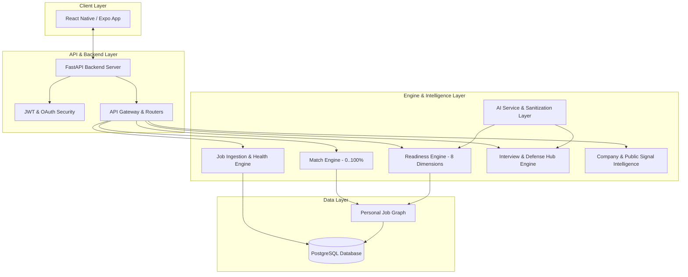
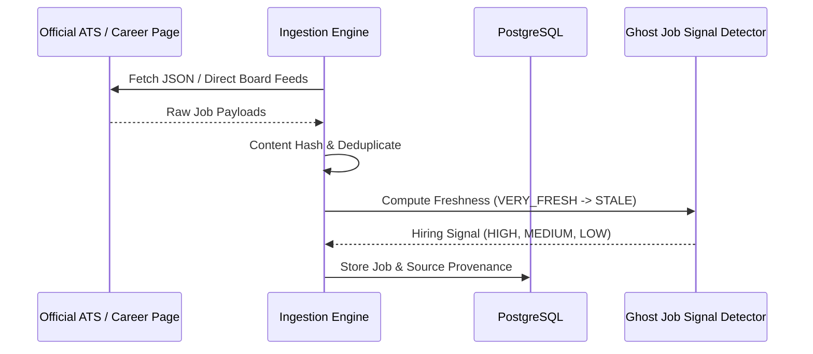

# JobBlitz Architecture Specification

## 1. System Overview

JobBlitz is an AI-powered Job Discovery, Match Analysis, and Interview Readiness Platform built for software engineers and technology professionals.

## 2. Ingestion & Health Architecture

The Job Ingestion Engine fetches postings from official company career pages (Greenhouse, Lever, Ashby, ATS adapters), normalizes metadata, and detects job freshness and hiring health signals.

## 3. Dual Engine Architecture: Match Score vs. Readiness Score

- **Match Score (0–100%)**: Measures how well the job requirements match the candidate's existing background (Role title, Skill overlap, Experience level, Work type, Salary/Location).
- **Readiness Score (0–100%)**: Measures candidate preparation across 8 dimensions:
  1. Resume Alignment
  2. Skill Coverage
  3. Experience Evidence
  4. Application Readiness
  5. Technical Screen Readiness
  6. Behavioral Screen Readiness
  7. Company Knowledge
  8. Online Assessment (OA) Readiness

## 4. Security & Data Provenance

1. **Strict Sanitization**: External job descriptions and public text pass through a strict sanitization pipeline to prevent prompt injection attempts.
2. **Data Provenance Rules**: Every piece of intelligence displays its source type:
   - `OFFICIAL`: Directly from official company ATS or career portal.
   - `PUBLIC SIGNAL`: Aggregated from public candidate reports and discussion feeds.
   - `INFERENCE`: Algorithmic suggestion based on structured data.
3. **Candidate Privacy**: Zero scraping or exposure of private candidate data. Only user-submitted or anonymized public evidence is utilized.
