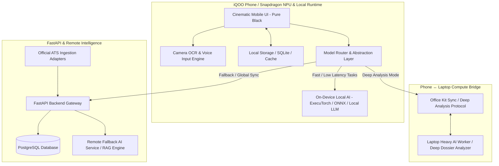
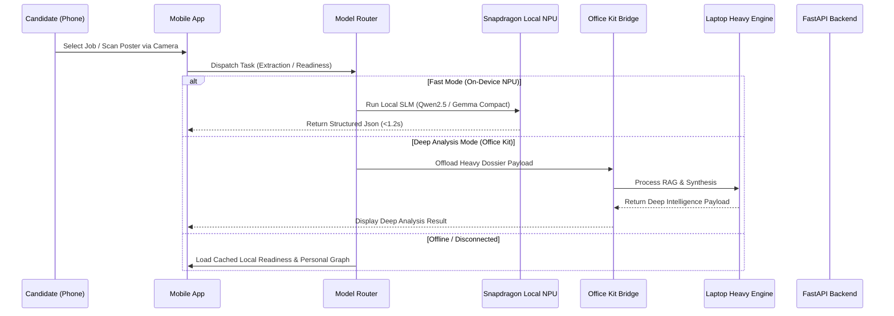

# JobBlitz — Hackathon Re-Architecture Master Blueprint
## Phone-First AI Job Search, Intelligence & Readiness Co-Pilot

---

## 1. CURRENT ARCHITECTURE SUMMARY

### 1.1 Existing Tech Stack & Flow
* **Frontend**: React Native + Expo (TypeScript), Zustand for client state management, React Query for server data fetching, Vanilla CSS/StyleSheet tokens (`#000000` dark theme).
* **Backend**: FastAPI (Python 3.12), PostgreSQL with SQLAlchemy ORM, Alembic migrations, Redis (configured for background tasks/Celery).
* **AI Layer**: Cloud-centric Google Gemini API (`google-generativeai`) called directly from the backend server (`app/services/ai_service.py`).
* **Ingestion & Data**: Fast seed data (`fast_seed.py`) inserting MNC postings, basic Greenhouse/Lever/JobSpy adapters.
* **Scoring**: Cloud-calculated Match Score (0–100%) and Readiness Score across 8 dimensions calculated on the FastAPI server.

### 1.2 Identified Limitations for Hackathon Criteria
1. **Cloud Dependency**: AI reasoning and match explanations rely entirely on remote backend calls to Gemini API. If network latency spikes or offline, AI features freeze.
2. **Missing Local Model Runtime**: No on-device LLM/NPU integration currently active on the mobile client.
3. **Missing Office Kit Compute Bridge**: Laptop ↔ Phone connection currently exists only as passive state sync rather than an explicit compute offload bridge.
4. **Missing Native Hardware Workflows**: Camera OCR for job posters/flyers and real-time voice interview coaching are not implemented.
5. **Data Provenance Enforcement**: Provenance tags (`OFFICIAL`, `PUBLIC SIGNAL`, `INFERENCE`) are present in schemas but require explicit evidence visualization panels in the mobile UI.

---

## 2. TARGET ARCHITECTURE



---

## 3. GAP ANALYSIS & SPECIFICATION MATRIX

| Dimension | Current Implementation | Target Hackathon Architecture | Gap & Mitigation |
| :--- | :--- | :--- | :--- |
| **Compute Location** | Backend Cloud Server | Phone-First + Local NPU + Laptop Bridge | Add Model Router & ONNX/ExecuTorch local inference engine on phone. |
| **AI Runtime** | Remote Gemini API | Snapdragon NPU (Local compact LLM/SLM) + Remote Fallback | Implement `AIModelProvider` interface supporting `LocalNPUProvider`, `OfficeKitProvider`, and `RemoteFallbackProvider`. |
| **Office Kit Integration**| Basic web/mobile sync | Explicit **Fast Mode vs Deep Analysis Mode** compute bridge | Create visible "Deep Work" offload protocol for 20-page dossiers & heavy PDF parsing. |
| **Phone Capabilities** | Screen touches & text inputs | Camera OCR (Job poster scanning) & Voice Interview Coach | Integrate Expo Camera + Local Vision/OCR + Speech-to-Text for STAR mock interviews. |
| **Offline Resilience** | Network-dependent | Full offline feed, local match score, cached readiness | Store Personal Job Graph & cached readiness locally; queue sync operations. |
| **Security Boundary** | Basic string escaping | Strict Untrusted Content Boundary & Prompt Injection Defense | Add multi-stage Sanitizer → Extractor → Validator pipeline for all external job text. |
| **Data Provenance** | Backend enum fields | Visible Evidence Panel in UI with `OFFICIAL`, `PUBLIC SIGNAL`, `INFERENCE` pills | Build interactive "Why this match?" Evidence Modal linked to raw data sources. |

---

## 4. MIGRATION & RE-ARCHITECTURE PLAN



---

## 5. AI MODEL & PHONE/NPU STRATEGY

### 5.1 On-Device Model Selection & Benchmark Criteria
* **Target Device**: iQOO Phone powered by Snapdragon NPU.
* **Model Format**: INT4/INT8 Quantized GGUF/ONNX/ExecuTorch format.
* **Target Compact Models**:
  - **Qwen2.5-Coder-1.5B-Instruct / 3B-Instruct** (Primary choice for structured extraction, JSON output, and coding skill analysis).
  - **Gemma-2B-IT** (Alternative compact model for conversational interview coaching).
* **Selection Metric Formula**:
  $$\text{Selection Score} = \frac{\text{Quality (1-10)} \times \text{Token Throughput (tok/s)}}{\text{Memory Footprint (GB)} \times \text{Latency (s)}}$$

### 5.2 Model Router Abstraction (`AIModelProvider`)

```typescript
export interface ModelTaskRequest {
  taskType: 'job_extraction' | 'match_reasoning' | 'resume_defense' | 'deep_analysis' | 'voice_coaching';
  prompt: string;
  context: Record<string, any>;
  preferLocal?: boolean;
}

export interface ModelTaskResponse {
  result: any;
  providerUsed: 'LocalNPU' | 'LocalCPU' | 'OfficeKit' | 'RemoteCloud';
  latencyMs: number;
  confidenceScore: number;
  evidence: Array<{ source: string; type: 'OFFICIAL' | 'PUBLIC_SIGNAL' | 'INFERENCE' }>;
}
```

---

## 6. OFFICE KIT COMPUTE BRIDGE ARCHITECTURE

### 6.1 Mode Switching Protocol
- **Fast Mode (Phone-Only / Red Light Test)**:
  - Executes task on-device via Snapdragon NPU or local CPU fallback.
  - Zero latency network dependency. Ideal for instant feed scrolling, match score checks, and quick gap summaries.
- **Deep Analysis Mode (Office Kit / Green Light Test)**:
  - Phone detects local laptop companion over Wi-Fi / ADB bridge.
  - Offloads multi-page resume PDF parsing, 50-job bulk analytics, and deep web company signal synthesis to laptop.
  - Visual status indicator on phone: `[DEEP WORK MODE ACTIVE — Computing via Office Kit Laptop]`.

---

## 7. PROMPT INJECTION DEFENSE & UNTRUSTED CONTENT GATEWAY

```
Raw Untrusted Input (Job Description / Web Text)
       │
       ▼
┌──────────────────────────────────────────┐
│ STAGE 1: Sanitizer                       │
│ - Strip control tokens, system keywords  │
│ - Escape system instructions             │
└──────────────────┬───────────────────────┘
                   │
                   ▼
┌──────────────────────────────────────────┐
│ STAGE 2: Structured Context Enclosing    │
│ - Wrap in strictly delimited XML tags    │
│   <untrusted_job_content>...</...>       │
└──────────────────┬───────────────────────┘
                   │
                   ▼
┌──────────────────────────────────────────┐
│ STAGE 3: Model Execution                 │
│ - Enforce JSON Schema output constraint │
└──────────────────┬───────────────────────┘
                   │
                   ▼
┌──────────────────────────────────────────┐
│ STAGE 4: Schema Validation & Whitelist  │
│ - Reject any output violating schema     │
└──────────────────────────────────────────┘
```

---

## 8. CINEMATIC MOBILE UI DESIGN & DEMO STORYBOARD

### 8.1 Visual Theme Guidelines
- **Background**: Pure Black `#000000` (OLED high contrast).
- **Surface Elevation**: `#0A0A0A` (Card), `#111111` (Elevated Card), `#1F1F1F` (Borders).
- **Typography**: Clean technical sans-serif with high contrast numbers (`94%`, `78%`).
- **Hero Scoring Display**:
  - `94% MATCH` (Cyan/Brand Accent) — Reflects profile alignment.
  - `78% READY` (Emerald/Success Accent) — Reflects interview & project preparation.
- **Evidence Pills**: Distinct visual markers for `[OFFICIAL]`, `[PUBLIC SIGNAL]`, and `[AI INFERENCE]`.

### 8.2 End-to-End 3-Minute Hackathon Demo Storyboard

```
1. APP OPEN (0:00 - 0:20)
   - User opens JobBlitz on iQOO Phone.
   - Daily Command Center shows: "Today's Action Plan: 3 High-Priority Jobs, 1 Mock Interview".

2. DUAL SCORING & EVIDENCE (0:20 - 0:50)
   - Taps "Senior AI Engineer — Paytm".
   - Hero Badges show: 94% MATCH | 72% READY.
   - Taps "Why 72% Ready?" -> Interactive Evidence Panel highlights missing System Design proof & STAR story requirement.

3. CAMERA JOB CAPTURE (0:50 - 1:20)
   - User points phone camera at a printed hiring poster / QR code.
   - Instant OCR extracts Company, Title, and Skills on-device via NPU.
   - App automatically creates job intelligence profile.

4. VOICE MOCK INTERVIEW & RESUME DEFENSE (1:20 - 2:15)
   - Taps "Start Mock Interview".
   - Speaks response to resume defense question ("Explain trade-offs in your PyTorch project").
   - On-device speech recognition + local AI evaluates STAR structure & technical depth in real-time.

5. OFFICE KIT DEEP WORK BRIDGE (2:15 - 2:45)
   - Taps "Deep Analysis Mode".
   - Office Kit transfers 20-page company dossier to laptop for processing.
   - Laptop returns synthesized candidate benchmark report to phone in 2 seconds.

6. APPLICATION GATE & TRACKER (2:45 - 3:00)
   - Application Quality Gate verifies: Profile Ready, Resume Variant Tailored, Project Evidence Mapped.
   - User approves application with 1 tap.
   - Application pipeline moves to "Applied" with automated follow-up timer set.
```

---

## 9. 30-HOUR HACKATHON BUILD TIMETABLE

| Time Block | Focus Area | Deliverables | Priority |
| :--- | :--- | :--- | :--- |
| **Hours 0 – 4** | Setup & Schemas | Repository structure, Model Router abstractions, JSON Schemas for Local AI. | **P0** |
| **Hours 4 – 10** | Local AI & NPU Integration | ExecuTorch/ONNX local inference setup on phone, Qwen2.5/Gemma compact model integration. | **P0** |
| **Hours 10 – 16** | Phone UI & Dual Scoring | Pure Black UI, `94% MATCH` vs `78% READY` hero badges, Evidence Panel modal. | **P0** |
| **Hours 16 – 20** | Phone Hardware Features | Camera OCR scanner for job posters & Speech-to-Text STAR voice coach. | **P1** |
| **Hours 20 – 24** | Office Kit Compute Bridge | Fast Mode vs Deep Analysis Mode toggle & phone ↔ laptop sync protocol. | **P1** |
| **Hours 24 – 28** | Application Quality Gate | Resume Tailoring Review, Application Tracker Pipeline, Failsafe offline state. | **P0** |
| **Hours 28 – 30** | Testing & Polish | 60 FPS UI audit, Red Light (phone-only) test, 3-minute demo practice. | **P0** |

---

## 10. RISK REGISTER & FAILSAFE MITIGATIONS

| Risk ID | Description | Severity | Failsafe Mitigation Strategy |
| :--- | :--- | :--- | :--- |
| **R-01** | Local NPU memory allocation failure on mobile device | High | Model Router automatically falls back to lightweight local CPU execution or cached heuristic scoring. |
| **R-02** | Office Kit Wi-Fi connection drops during Deep Analysis | Medium | Phone automatically falls back to Fast Mode on-device execution without freezing UI. |
| **R-03** | Prompt injection attempt in scraped job posting | Critical | Untrusted text pass-through sanitizer strips system keywords and enforces strict JSON Schema parsing. |
| **R-04** | Latency spike in speech-to-text during voice interview | Medium | Stream voice audio with local Whisper/Android Speech Recognizer; display real-time transcript feedback. |
