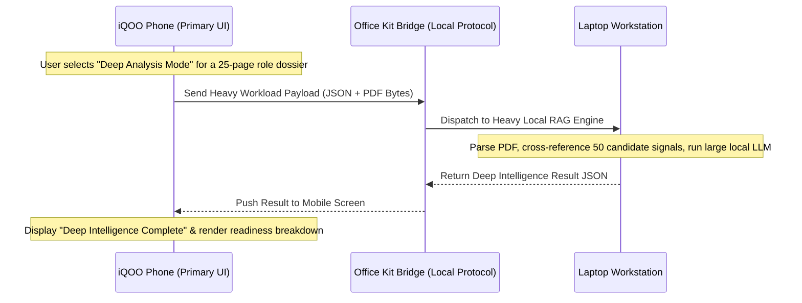

# JobBlitz — Office Kit Architecture Specification

## 1. Concept & Compute Bridge Narrative

Office Kit is a **Compute Extension Bridge** between the mobile phone (primary user interface & rapid interaction device) and the laptop companion (heavy compute workstation).

## 2. Dual-Mode Specification

### 2.1 FAST MODE (Phone / NPU - Red Light Capable)
- Runs 100% locally on the phone using Snapdragon NPU / local CPU.
- Zero network dependency.
- **Tasks**:
  - Instant job feed match scoring.
  - Skill gap extraction.
  - Camera OCR job flyer scanning.
  - 1-minute voice STAR interview feedback.

### 2.2 DEEP ANALYSIS MODE (Office Kit / Laptop - Green Light Enhanced)
- Triggered explicitly via UI toggle: `[DEEP ANALYSIS — Office Kit Active]`.
- Communicates via local high-speed HTTP / WebSocket server running on the laptop.
- **Tasks**:
  - Multi-page PDF resume & portfolio deep analysis.
  - Cross-referencing 50+ public hiring signals for target MNCs.
  - Multi-job bulk comparison matrix generation.
  - Full company dossier synthesis.

## 3. Graceful Fallback Protocol
If the laptop connection drops or Office Kit becomes unreachable:
1. Mobile app displays a subtle status pill: `[OFFICE KIT OFFLINE — Running in Fast On-Device Mode]`.
2. Model Router automatically reroutes pending requests to `LocalNPU` or `LocalCPU` without crashing or freezing the mobile UI.
